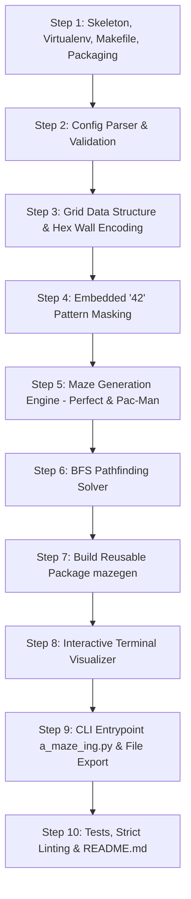

# Implementation Plan: A-Maze-ing (42 Curriculum)

## Overview
A complete, robust, and standards-compliant maze generation, solving, and interactive visualization suite in Python (>=3.10) adhering to the 42 subject specification ("A-Maze-ing"). The project features modular architecture, a reusable distribution package (`mazegen-*`), strict error handling, bitwise hexadecimal encoding, Pac-Man style playable boards, exact single-path perfect mazes, embedded "42" patterns, Breadth-First Search (BFS) pathfinding, ANSI terminal visualization with real-time interactivity, and full compliance with `flake8` and `mypy --strict`.

---

## 10-Step Roadmap & Architecture

---

### Step 1: Project Skeleton, Virtual Environment, Makefile & Packaging Config
- **Concept & Mindset**: Lay down standard project architecture following Python packaging conventions (`src/` layout) and 42 Makefile constraints before writing code.
- **Components**:
  - Root directory: `a_maze_ing`
  - Python virtual environment: `.venv`
  - Packaging files: `pyproject.toml`, `setup.py` (or `pyproject.toml` with `setuptools`/`build` for generating `.whl` and `.tar.gz`)
  - Project configuration: `.gitignore`, `.flake8`, `mypy.ini` (strict type checking)
  - `Makefile`: Targets `install`, `run`, `debug`, `clean`, `lint`, `lint-strict`, `build`, `test`
  - `LICENSE.md`: Explicit open source license (MIT or Apache 2.0) permitting reuse and distribution by later projects

---

### Step 2: Configuration File Parser & Graceful Error Handling
- **Subject Requirement**: Key-value pairs (`KEY=VALUE`), comments (`#`), mandatory keys (`WIDTH`, `HEIGHT`, `ENTRY`, `EXIT`, `OUTPUT_FILE`, `PERFECT`), optional keys (`SEED`, `ALGORITHM`, `WALL_COLOR`), graceful failure with informative error messages on file not found, bad syntax, impossible dimensions, or out-of-bounds coords.
- **Design**:
  - `Config` dataclass with type hints and validation methods.
  - Dedicated custom exceptions (`ConfigError`, `ParseError`).
  - Validation:
    - Width/Height $\ge 3$ (and check minimum size for "42" pattern).
    - Entry/Exit format `x,y` (0-indexed integer coordinates within bounds $[0, \text{WIDTH}-1] \times [0, \text{HEIGHT}-1]$).
    - Entry $\neq$ Exit.
    - Boolean parsing for `PERFECT` (`True`/`False`, `1`/`0`, `yes`/`no`).

---

### Step 3: Maze Grid Representation, Coordinate System & Hex Encoding
- **Bitwise Wall Representation** (Subject Specification):
  - Bit 0 (LSB, $1$): North wall closed
  - Bit 1 ($2$): East wall closed
  - Bit 2 ($4$): South wall closed
  - Bit 3 ($8$): West wall closed
  - Initial state: all walls closed ($1 + 2 + 4 + 8 = 15 = \text{0xF}$).
- **Coherence**:
  - Shared walls between adjacent cells $(x, y)$ and $(x', y')$ must always be synchronized (e.g. carving South in $(x, y)$ simultaneously carves North in $(x, y+1)$).
  - External boundary cells strictly retain outer walls.
- **Methods**:
  - `Cell` and `Grid` classes with bit manipulation (`has_wall`, `open_wall`, `close_wall`, `to_hex`).

---

### Step 4: The "42" Embedded Pattern Generation
- **Subject Requirement**: The maze must contain a visible "42" drawn by several fully closed cells ($0\text{xF}$).
  - If the maze is too small to fit "42", omit it and output an informative message.
  - Centered or well-positioned in the maze.
  - Corridors cannot be $\ge 3\times 3$ open space.
- **Design**:
  - Matrix bitmap template for "4" and "2" (e.g. $5\times 3$ for each digit, separated by 1 column, total $5 \times 7$ bounding box).
  - Mark cells belonging to "42" as `is_pattern = True`.
  - Pattern cells have all 4 walls closed ($0\text{xF}$) and cannot be traversed or connected into the regular corridors.
  - Surrounding cells must form coherent walls against the pattern cells.

---

### Step 5: Maze Generation Core (`PERFECT=True` vs `PERFECT=False`)
- **Mode 1: `PERFECT=True`**:
  - Perfect maze with exactly one unique path between any two reachable cells (Spanning Tree, zero cycles).
  - Algorithm: Randomized Prim's algorithm or Kruskal's or Depth-First Search with backtracking.
  - Ensures every non-pattern cell is connected into a single component.
- **Mode 2: `PERFECT=False` (Default - Pac-Man Style)**:
  - Board directly playable in Pac-Man style:
    1. Every corridor reachable (full connectivity).
    2. Four corners and the centre are open corridors (ghosts/power-pellets in corners, player at centre).
    3. At least two independent routes (loops) so a chased player always has alternative paths.
    4. Dead-ends kept rare (ideal: zero or near-zero dead ends).
  - Strategy: Generate initial spanning tree, ensure central area and 4 corners are carved/open, then systematically remove dead-end walls or create concentric corridor loops while strictly preserving the $\le 2$-wide corridor rule (no $3\times 3$ open voids).

---

### Step 6: Pathfinding Solver (Breadth-First Search)
- **Subject Requirement**: Find the shortest valid path from `ENTRY` to `EXIT`, encoded as a string of directional steps: `N`, `E`, `S`, `W`.
- **Design**:
  - Classic Queue-based BFS starting from `ENTRY` to `EXIT` traversing only open walls between adjacent non-pattern cells.
  - Store parent pointer `parent[cell] = (prev_cell, direction)`.
  - Reconstruct path backwards from `EXIT` to `ENTRY`, then reverse to yield the directional sequence string (e.g., `SWSESW...`).
  - Gracefully handle cases where no path exists (though valid generation guarantees one).

---

### Step 7: Building & Testing the Reusable Package (`mazegen-*`)
- **Subject Requirement**:
  - Implement maze generation as a standalone class `MazeGenerator` inside module `mazegen`.
  - Packaged as a single file `mazegen-*.whl` or `mazegen-*.tar.gz` at repository root.
  - Standard packaging config (`pyproject.toml`) so reviewers can build in a fresh virtualenv (`python -m build`).
  - Module provides access to maze structure and solution path.
  - Included `LICENSE.md`.

---

### Step 8: Interactive Terminal Visualizer
- **Subject Requirement**:
  - Terminal ASCII/ANSI rendering showing outer walls, internal walls, entry (e.g., magenta), exit (e.g., red), 42 pattern (gray/custom color), and shortest path (cyan/blue).
  - Interactive menu:
    1. Re-generate a new maze.
    2. Show/Hide shortest path.
    3. Change wall colors.
    4. Quit.
  - Clean ANSI escapes, responsive keyboard/choice loop, robust on both POSIX and Windows terminals.

---

### Step 9: CLI Integration (`a_maze_ing.py`) & Output File Generation
- **CLI Usage**: `python3 a_maze_ing.py config.txt`
- **Output File Structure**:
  - Maze cells row by row in hexadecimal digits ($W$ digits per line, $H$ lines).
  - Empty newline `\n`.
  - Entry coordinates: `x,y\n`
  - Exit coordinates: `x,y\n`
  - Path: string of directional characters `[NESW]*\n`
- **Error Handling**: Missing argument, extra arguments, non-existent config, bad syntax, invalid dimensions.

---

### Step 10: Comprehensive Testing, Strict Linting & Documentation
- **Automated Tests**:
  - Unit tests for parser, bitwise encoding, generator modes, BFS solver, output formatting.
  - Validation against the subject analyzer specifications.
- **Linting & Type Safety**:
  - `flake8 .` clean (0 errors/warnings).
  - `mypy . --strict` clean (100% type annotated, 0 errors).
- **README.md**:
  - Required 42 header: `*This activity has been created as part of the 42 curriculum by <login>.*`
  - Sections: Description, Instructions, Resources & AI Usage, Config file format, Algorithm choice and rationale, Reusable code guide, Team & Project Management.

---

## User Review & Verification Points
- Milestone pacing: strictly 1 step at a time with comprehensive explanations.
- Step 1 creates the workspace, package structure, virtualenv, Makefile, and standard configurations.
